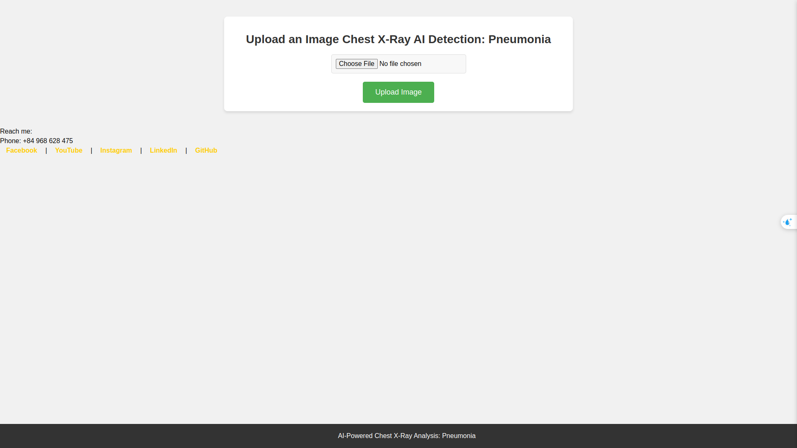

Dưới đây là mẫu README cho dự án **Chest X-ray Pneumonia Detection using YOLOv11**:

---

# Chest X-ray Pneumonia Detection using YOLOv11

## Tổng Quan
Dự án này sử dụng mô hình YOLOv11 để phát hiện bệnh viêm phổi từ hình ảnh X-quang ngực. Mô hình học sâu YOLOv11 được huấn luyện để phân loại các hình ảnh X-quang thành hai nhóm: bình thường và viêm phổi. Đây là một ứng dụng mạnh mẽ giúp hỗ trợ chẩn đoán viêm phổi sớm, góp phần cải thiện chất lượng chăm sóc sức khỏe.

## Tính Năng
- **Phát hiện viêm phổi từ hình ảnh X-quang:** Dự án sử dụng YOLOv11 để phát hiện viêm phổi trong hình ảnh X-quang ngực.
- **Chú thích hình ảnh:** Các khu vực phát hiện viêm phổi được đánh dấu trên hình ảnh.
- **Dễ sử dụng:** Giao diện web đơn giản cho phép tải lên và xử lý hình ảnh X-quang.

## Yêu Cầu
- Python 3.x
- Flask
- OpenCV
- YOLOv11
- Supervision
- TensorFlow
- Keras

## Demo


## Cài Đặt

1. Clone repository:
    ```bash
    git clone https://github.com/duonghiepit/Detect-Pneumonia-Xray.git
    ```

2. Cài đặt các phụ thuộc:
    ```bash
    pip install -r requirements.txt
    ```

3. Đảm bảo mô hình YOLOv11 đã được tải về và lưu trữ tại `model/best.pt`.

## Cấu Trúc Thư Mục

```
Chest-Xray-Pneumonia-YOLOv11/
│
├── uploads/                # Thư mục chứa các hình ảnh tải lên
├── outputs/                # Thư mục chứa các hình ảnh đã được chú thích
├── model/                  # Thư mục chứa mô hình YOLOv11
├── app.py                  # File chính của Flask
├── requirements.txt        # Danh sách các gói phụ thuộc
└── README.md               # Tài liệu hướng dẫn
```

## Hướng Dẫn Sử Dụng

### Chạy Ứng Dụng

1. Khởi chạy ứng dụng Flask:
    ```bash
    python app.py
    ```

2. Truy cập vào địa chỉ `http://127.0.0.1:5000/` trên trình duyệt.

3. Tải lên hình ảnh X-quang để mô hình YOLOv11 phát hiện viêm phổi và trả về hình ảnh đã được chú thích.

### Quy Trình Phát Hiện

1. Tải lên hình ảnh X-quang thông qua form trong giao diện web.
2. Hình ảnh sẽ được lưu vào thư mục `uploads`.
3. Mô hình YOLOv11 sẽ phát hiện viêm phổi trong hình ảnh.
4. Hình ảnh sẽ được chú thích với các khu vực phát hiện viêm phổi và lưu vào thư mục `outputs`.
5. Hình ảnh đã chú thích sẽ được trả về cho người dùng.

## Giấy Phép
Dự án này được cấp phép theo giấy phép MIT - xem file [LICENSE](LICENSE) để biết chi tiết.

## Cảm Ơn
Cảm ơn các tác giả của các thư viện và mô hình được sử dụng trong dự án này, bao gồm Flask, YOLOv11, OpenCV và Supervision.

---

Hy vọng mẫu README này sẽ giúp bạn cung cấp thông tin chi tiết và hướng dẫn dễ hiểu cho người dùng!
